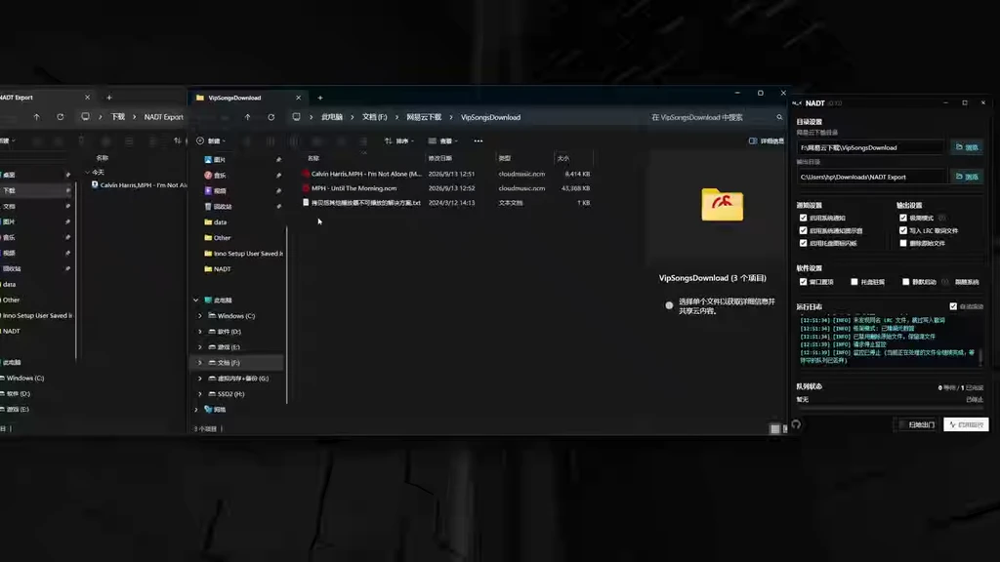
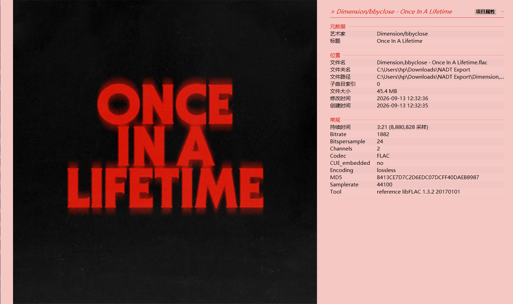
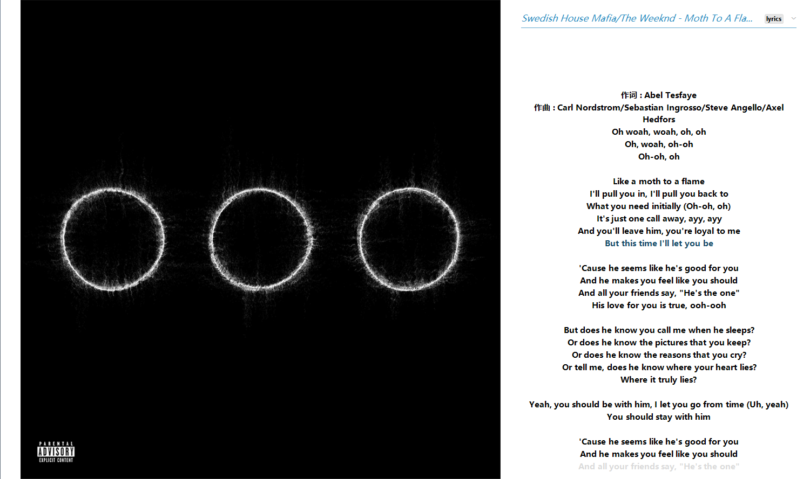
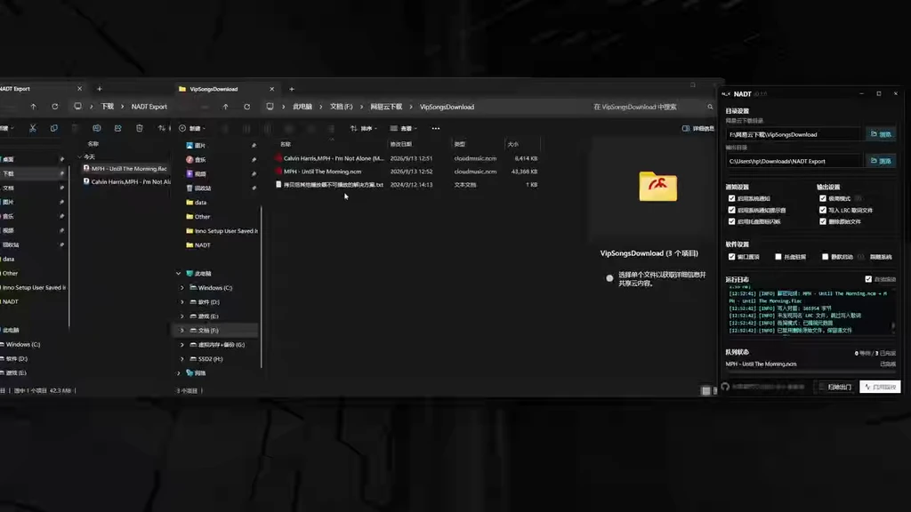
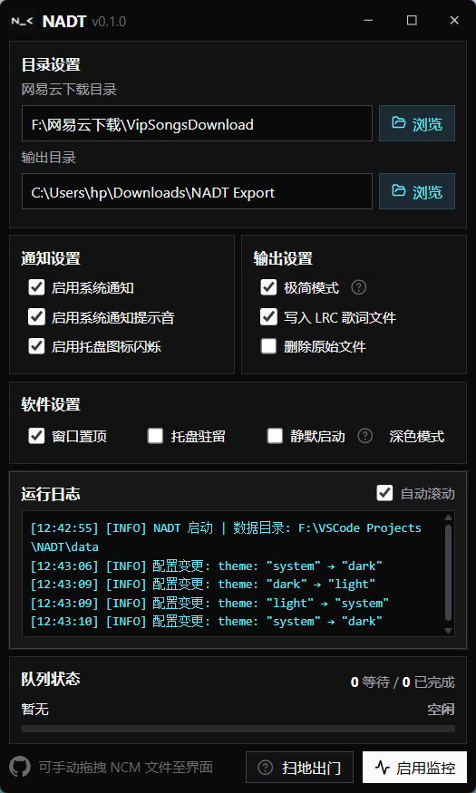
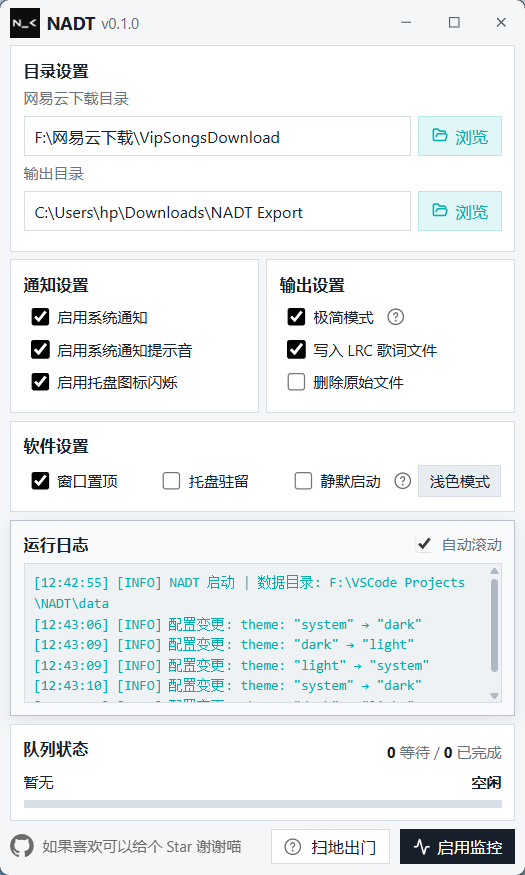

  

<b>NCM-Auto-Dump-Tool</b>

	
	
	
	
	
	
	

<a href="#项目介绍">项目介绍</a> · <a href="#功能展示">功能展示</a> · <a href="#如何安装">如何安装</a> · <a href="#如何使用">如何使用</a> · <a href="#其他内容">其他内容</a>

---

## 项目介绍 ℹ️

NCM-Auto-Dump-Tool（简称 NADT）是一款简单的小工具，可以自动监控网易云音乐下载的 NCM 格式文件，并将其转换为 MP3 / FLAC 格式。

在监控启动后 NADT 会持续监控指定的下载目录，在发现新的 NCM 文件后自动将其加入处理队列并执行转换，随后输出到指定的输出目录。

除此之外，NADT 也支持也支持手动拖拽 NCM 文件添加至处理队列并排队参与转换，同时支持系统通知提示，静默启动，Tag 写入，自动清理已转换的 NCM 文件，自动写入对应 LRC 歌词文件等功能。

> **性能实测：50 首 FLAC 格式文件，共 1.5 GB，解密总耗时约 10 秒**
>
> **测试条件：无精简模式、无 LRC 文件写入、无删除原文件**

> 使用本项目时请务必遵守相关法律法规，尊重网易云音乐的服务条款

> 使用过程中产生的任何问题均与作者无关，请自行承担风险

> 本项目以 GPLv3 开源，使用、修改或分发时请遵守该协议

## 功能展示 ✨

### 持续监控 / 自动转换

### 手动拖拽

### Tag 写入

  
  

### 自动清理

### 系统通知

### 深浅主题

  
  

---

## 如何安装 📥

本软件目前仅支持 **Windows 10/11 x64** 且已安装 **WebView2**。

前往 [Releases](https://github.com/SmallM1NG/NCM-Auto-Dump-Tool/releases/latest) 下载最新版本，安装包版运行安装程序并按照提示完成安装，双击桌面快捷方式即可，便携版将压缩包完整解压到任意目录，随后运行 NADT.exe 即可。

> 由于没有交保护费，部分浏览器下载可能会提示有危害，点击保留即可。
>
> 本喵承诺绝无恶意代码（我也不会啊），清者自清。

---

## 如何使用 ▶️

### 1. 设置 **下载目录**

在“**网易云下载目录**”中选择包含 `VipSongsDownload` 的下载根目录，或直接选择 `VipSongsDownload` 文件夹。

### 2. 设置 **输出目录**

在“**输出目录**”中选择转换后 **MP3 / FLAC** 文件的保存位置。

### 3. **启用监控**

点击“**启用监控**”后，NADT 将开始监控下载目录，新出现的 `.ncm` 文件会自动加入 **处理队列**。如队列中还有待处理曲目时停止监控，当前正在处理的曲目会被完整处理，待处理的曲目将被丢弃。

### 4. **手动拖入**

也可以手动将文件直接拖入 NADT 界面窗口以加入 **处理队列**，即使 **监控未启用**，手动拖入的曲目仍然会全部 **即时处理**。

### 5. **偏好配置**

你可以按需求调整“**通知设置**”和“**输出设置**”中的配置项。如变更配置时监控处于启用状态，则只有在下一次启动监控时才会应用配置变更；**手动拖入**为即时变更。

---

## 其他内容 📚

### 补充说明 💡

#### 1. 软件无法运行

请确保符合“如何安装”条目中写明的系统要求，并尝试更换安装目录。

#### 2. 处理后的文件缺少封面？

可能是元数据内本身就没有带封面。软件并没有联网获取封面的功能，只会解析文件内的封面信息。

#### 3. LRC 歌词写入是什么？

3.0 版本网易云在下载时部分曲目会附带一个 LRC 文件。如果软件在处理曲目时发现有同名 LRC 文件，则会自动写入 Tag 中的 `lyrics` 字段；没有同名 LRC 文件则跳过处理。

---

### BUG 汇报 😨

请详细描述遇到的问题：**具体行为**、是否可以复现，并提供 **NADT 版本**、**Windows 版本**、复现步骤、相关截图以及运行日志文件。

---

### 鸣谢 🙌

[ncmdump](https://github.com/taurusxin/ncmdump)

---

### LINK 🔗

<a href="https://space.bilibili.com/475951038">BILIBILI</a>

---

### 捐赠 🧋

	🥰请我喝奶茶喵 谢谢你喵🥰

	

